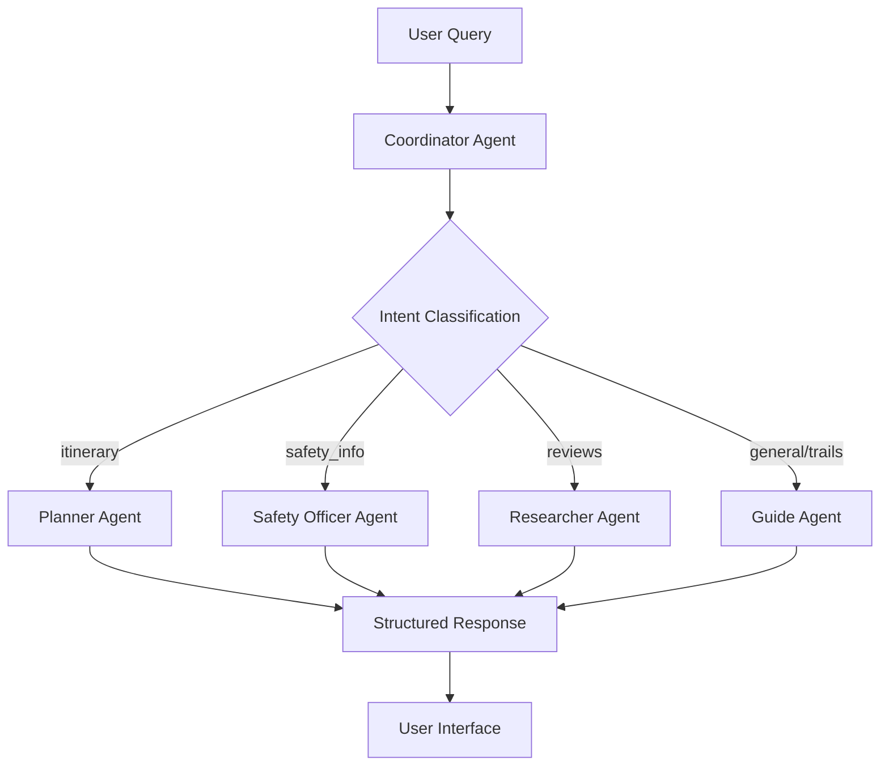
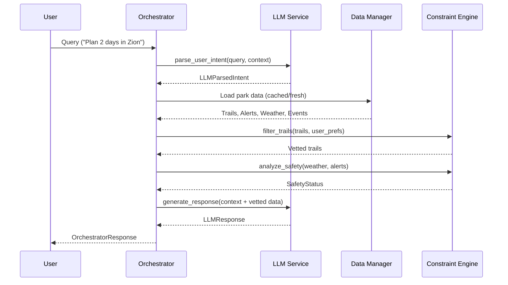

# AI, LLM, Agentic AI & Pydantic Architecture Analysis

> **Author:** Sr. Gen AI Developer Analysis  
> **Date:** 2026-01-18  
> **Scope:** Comprehensive analysis of LLM, Agentic AI, and Pydantic usage in the Outdoor Concierge application

---

## Executive Summary

The **Outdoor Adventure Concierge** is a sophisticated AI-powered national park trip planning application that leverages:

1. **Google Gemini LLM** for natural language understanding, intent parsing, and response generation
2. **Agentic AI Architecture** with specialized worker agents for different aspects of park guidance
3. **Pydantic** for robust data validation, schema enforcement, and type safety across 60+ data models

This document provides an in-depth analysis of how these technologies are implemented and how they contribute to the application's functionality.

---

## Table of Contents

1. [LLM Integration Architecture](#1-llm-integration-architecture)
2. [Agentic AI Pattern Implementation](#2-agentic-ai-pattern-implementation)
3. [Pydantic Data Models & Validation](#3-pydantic-data-models--validation)
4. [Data Flow & Orchestration](#4-data-flow--orchestration)
5. [LLM-Powered Data Enrichment Scripts](#5-llm-powered-data-enrichment-scripts)
6. [Key Design Patterns](#6-key-design-patterns)
7. [Impact on Final Outcome](#7-impact-on-final-outcome)

---

## 1. LLM Integration Architecture

### 1.1 Core LLM Service (`app/services/llm_service.py`)

The application uses **Google's Gemini API** (via `google-genai` SDK) as its primary LLM provider.

#### Key Configuration
```python
from google import genai
from google.genai import types

class GeminiLLMService:
    def __init__(self, api_key: str, model_name: Optional[str] = None):
        self.model_name = model_name or os.getenv("GEMINI_MODEL") or "gemini-2.5-flash"
        self.client = genai.Client(api_key=api_key)
```

**Supported Models:**
- `gemini-2.5-flash` (default for main chat)
- `gemini-1.5-flash` (used in data scraping scripts)
- `gemini-3-flash-preview` (testing)

### 1.2 LLM Functionality Matrix

| Function | Purpose | Input | Output |
|----------|---------|-------|--------|
| `parse_user_intent()` | Extract structured intent from natural language | User query + context | `LLMParsedIntent` (Pydantic model) |
| `generate_response()` | Create contextual park guidance responses | Intent + park data context | `LLMResponse` (Pydantic model) |
| `extract_reviews_from_text()` | Extract trail reviews from scraped web content | Raw markdown text | `List[TrailReview]` |

### 1.3 Structured Output Generation

The application leverages Gemini's **structured output mode** for reliable JSON extraction:

```python
# From scripts/refine_trails_with_gemini.py
response = client.models.generate_content(
    model=GEMINI_MODEL,
    contents=prompt,
    config={
        'response_mime_type': 'application/json',
        'response_schema': TrailStats  # Pydantic model as schema
    }
)
stats = response.parsed  # Direct parsing to Pydantic object
```

This pattern ensures:
- Type-safe outputs from LLM
- Automatic validation against Pydantic schemas
- Reduced JSON parsing errors

---

## 2. Agentic AI Pattern Implementation

### 2.1 Agent Worker Abstraction

The application implements a **multi-agent architecture** with specialized workers, each designed for specific tasks:

```python
class AgentWorker:
    def __init__(self, client: genai.Client, model_name: str, role: str, instruction: str):
        self.client = client
        self.model_name = model_name
        self.role = role
        self.instruction = instruction

    def execute(self, prompt: str) -> str:
        response = self.client.models.generate_content(
            model=self.model_name,
            contents=prompt,
            config=types.GenerateContentConfig(
                system_instruction=self.instruction,
                temperature=0.7 if self.role == "planner" else 0.3  # Role-specific temperature
            )
        )
        return response.text.strip()
```

### 2.2 Specialized Agent Roles

The `GeminiLLMService` class initializes **5 specialized agents**:

| Agent | Role | Temperature | Purpose |
|-------|------|-------------|---------|
| **Coordinator** | `coordinator` | 0.3 | Intent parsing, JSON extraction, query classification |
| **Planner** | `planner` | 0.7 | Multi-day itinerary creation, trip scheduling |
| **Guide** | `guide` | 0.3 | Trail recommendations, park information, photo spots |
| **Safety Officer** | `safety` | 0.3 | Alert analysis, weather hazard assessment |
| **Researcher** | `researcher` | 0.3 | Review extraction, deep-dive information |

#### Agent Initialization Code
```python
# 1. The Coordinator
self.agent_coordinator = AgentWorker(
    self.client, self.model_name, "coordinator",
    "You are an intent parser. Extract structured data from queries into JSON."
)

# 2. The Planner
self.agent_planner = AgentWorker(
    self.client, self.model_name, "planner",
    f"You are an expert Travel Planner. Create logical day-by-day itineraries. {link_instruction}"
)

# 3. The Guide
self.agent_guide = AgentWorker(
    self.client, self.model_name, "guide",
    f"You are a local Park Ranger. Provide ranked lists of options with stats."
)

# 4. The Safety Officer
self.agent_safety = AgentWorker(
    self.client, self.model_name, "safety",
    f"You are a Park Safety Officer. Analyze alerts/weather."
)

# 5. The Researcher
self.agent_researcher = AgentWorker(
    self.client, self.model_name, "researcher",
    f"You are a helpful Research Assistant. Display reviews exactly as requested."
)
```

### 2.3 Response Type Routing

The orchestrator routes requests to appropriate agents based on parsed intent:

```python
ResponseType = Literal["itinerary", "list_options", "safety_info", "general_chat", "reviews", "entity_lookup"]

# Routing Logic in generate_response()
if intent.response_type == "entity_lookup":
    message = self.agent_guide.execute(prompt)  # Use Guide
elif intent.response_type == "reviews":
    message = self.agent_researcher.execute(prompt)  # Use Researcher
elif intent.response_type == "itinerary":
    message = self.agent_planner.execute(prompt)  # Use Planner
elif intent.response_type == "safety_info":
    message = self.agent_safety.execute(prompt)  # Use Safety Officer
else:
    message = self.agent_guide.execute(prompt)  # Default to Guide
```

### 2.4 Agent Collaboration Flow



---

## 3. Pydantic Data Models & Validation

### 3.1 Model Categories

The application uses Pydantic extensively across three categories:

#### A. Core Data Models (`app/models.py`)

| Model | Purpose | Key Fields |
|-------|---------|------------|
| `ParkContext` | Park metadata | `parkCode`, `fullName`, `location`, `weather_zones` |
| `TrailSummary` | Trail information | `name`, `difficulty`, `length_miles`, `recent_reviews` |
| `WeatherSummary` | Weather data | `current_temp_f`, `forecast`, `zones` |
| `Alert` | Park alerts | `title`, `description`, `category`, `url` |
| `Event` | Scheduled events | `title`, `date_start`, `images`, `tags` |
| `PhotoSpot` | Photography locations | `name`, `best_time_of_day`, `tips` |
| `ScenicDrive` | Driving routes | `name`, `distance_miles`, `highlights` |
| `Amenity` | Nearby services | `name`, `type`, `rating`, `google_maps_url` |

#### B. LLM Communication Models (`app/services/llm_service.py`)

```python
class LLMParsedIntent(BaseModel):
    """Structured representation of user intent parsed by LLM"""
    user_prefs: UserPreference
    park_code: Optional[str] = None
    target_date: Optional[str] = None
    duration_days: int = 1
    response_type: ResponseType = "itinerary"
    review_targets: List[str] = Field(default_factory=list)
    raw_query: str

class LLMResponse(BaseModel):
    """Structured LLM output"""
    message: str
    safety_status: Optional[str] = None
    safety_reasons: List[str] = Field(default_factory=list)
    suggested_trails: List[str] = Field(default_factory=list)
    debug_intent: Optional[LLMParsedIntent] = None
```

#### C. Orchestration Models (`app/orchestrator.py`)

```python
class SessionContext(BaseModel):
    """Maintains chat session state across queries"""
    current_park_code: Optional[str] = None
    current_user_prefs: UserPreference = Field(default_factory=UserPreference)
    current_itinerary: Optional[str] = None
    chat_history: List[str] = Field(default_factory=list)

class OrchestratorRequest(BaseModel):
    """Incoming request structure"""
    user_query: str
    session_context: SessionContext = Field(default_factory=SessionContext)

class OrchestratorResponse(BaseModel):
    """Outgoing response with full context"""
    chat_response: LLMResponse
    parsed_intent: LLMParsedIntent
    updated_context: SessionContext
    park_context: Optional[ParkContext] = None
    vetted_trails: List[TrailSummary] = []
    vetted_things: List[ThingToDo] = []
```

### 3.2 Advanced Pydantic Features Used

#### Model Validators
```python
# From app/models.py - TrailSummary
@model_validator(mode='after')
def set_defaults(self):
    if not self.difficulty:
        self.difficulty = "moderate"
    if self.average_rating is None:
        self.average_rating = 0.0
    # Ensure lists are never None
    if self.features is None: self.features = []
    return self

# From app/models.py - Place
@model_validator(mode='after')
def extract_url_from_body(self):
    if not self.url and self.bodyText:
        match = re.search(r'href=["\']([^"\']+)["\']', self.bodyText)
        if match:
            self.url = match.group(1)
    return self
```

#### Computed Properties
```python
# From app/models.py - TrailSummary
@property
def url(self) -> Optional[str]:
    """Returns the best available URL for the LLM context."""
    return self.nps_url or self.alltrails_url
```

#### Protocol Classes
```python
# From app/services/llm_service.py
class LLMService(Protocol):
    """Interface contract for LLM services"""
    def parse_user_intent(self, query: str, current_park_code: str = None) -> LLMParsedIntent: ...
    def generate_response(self, *, query: str, intent: LLMParsedIntent, ...) -> LLMResponse: ...
```

### 3.3 Pydantic with LLM Structured Output

The scripts use Pydantic models as **JSON schemas for Gemini structured output**:

```python
# From scripts/refine_trails_with_gemini.py
class TrailStats(BaseModel):
    is_valid_hiking_trail: bool = Field(False, description="True only for hiking trails")
    difficulty: Optional[str] = Field(None, description="Easy, Moderate, or Strenuous")
    length_miles: Optional[float] = Field(None, description="Total mileage")
    is_wheelchair_accessible: bool = Field(False)
    is_kid_friendly: bool = Field(False)
    is_pet_friendly: bool = Field(False)
    clean_description: Optional[str] = Field(None, description="Concise 1-2 sentence description")

# Usage - Gemini auto-parses to Pydantic model
response = client.models.generate_content(
    model=GEMINI_MODEL,
    contents=prompt,
    config={'response_mime_type': 'application/json', 'response_schema': TrailStats}
)
stats = response.parsed  # ← TrailStats instance
```

---

## 4. Data Flow & Orchestration

### 4.1 The Orchestrator (`app/orchestrator.py`)

The `OutdoorConciergeOrchestrator` is the **central coordination layer** that:

1. Parses user intent via LLM
2. Loads/caches park data (static + volatile)
3. Applies business logic constraints
4. Routes to appropriate agent
5. Returns structured responses

```python
class OutdoorConciergeOrchestrator:
    def __init__(self, llm_service, nps_client, weather_client, external_client):
        self.llm = llm_service
        self.nps = nps_client
        self.weather = weather_client
        self.external = external_client
        self.engine = ConstraintEngine()  # Business logic
        self.data_manager = DataManager()  # File caching
        self.review_scraper = ReviewScraper(self.llm)  # On-demand reviews
        self.park_fetcher = ParkDataFetcher(nps_client)  # API fetching
```

### 4.2 Query Processing Pipeline



### 4.3 Constraint Engine (`app/engine/constraints.py`)

Business logic layer using Pydantic models:

```python
class UserPreference(BaseModel):
    max_difficulty: str = "hard"
    min_rating: float = 0.0
    max_length_miles: float = 20.0
    dog_friendly: bool = False
    kid_friendly: bool = False
    wheelchair_accessible: bool = False

class SafetyStatus(BaseModel):
    status: str  # "Go", "Caution", "Danger", "Closed"
    reason: List[str] = []

class ConstraintEngine:
    def filter_trails(self, trails: List[TrailSummary], prefs: UserPreference) -> List[TrailSummary]:
        # Filter by difficulty, length, rating, accessibility
        ...
    
    def analyze_safety(self, weather: WeatherSummary, alerts: List[Alert]) -> SafetyStatus:
        # Analyze weather extremes, closures, hazards
        ...
```

---

## 5. LLM-Powered Data Enrichment Scripts

### 5.1 Trail Data Enrichment (`scripts/refine_trails_with_gemini.py`)

**Purpose:** Convert raw NPS API data into rich, structured trail information.

**Process:**
1. Load raw NPS `places` and `things_to_do` data
2. For each item, call Gemini to analyze if it's a valid hiking trail
3. Extract metrics (difficulty, length, elevation, accessibility)
4. Generate clean descriptions
5. Deduplicate similar trails
6. Save enriched `trails_v2.json`

```python
def extract_trail_stats(trail_item: Dict, client: genai.Client) -> Optional[TrailStats]:
    prompt = f"""
    You are a National Park expert. Analyze this place:
    Title: '{title}'
    Description: {desc_context}
    
    Instructions:
    1. DECIDE: Is this a hiking trail? (True/False)
    2. IF TRUE, extract: difficulty, length_miles, elevation_gain_ft, ...
    """
    
    response = client.models.generate_content(
        model=GEMINI_MODEL,
        contents=prompt,
        config={'response_mime_type': 'application/json', 'response_schema': TrailStats}
    )
    return response.parsed
```

### 5.2 Photo Spots Fetching (`scripts/fetch_photo_spots.py`)

**Purpose:** Scrape and extract photography location data from travel blogs.

**Pipeline:**
1. Search Google (via Serper API) for photography blog posts
2. Scrape blog content (via Firecrawl)
3. Use Gemini to extract structured photo spot data
4. Save `photo_spots.json`

```python
class PhotoSpot(BaseModel):
    rank: Optional[int] = None
    name: str
    description: str
    best_time_of_day: List[str]
    tips: List[str]
    image_url: Optional[str] = None

class PhotoGuide(BaseModel):
    spots: List[PhotoSpot]

# Gemini extraction
response = client.models.generate_content(
    model=gemini_model,
    contents=prompt,  # Contains scraped blog markdown
    config={'response_mime_type': 'application/json', 'response_schema': PhotoGuide}
)
guide = response.parsed
```

### 5.3 Scenic Drives Fetching (`scripts/fetch_scenic_drives.py`)

**Purpose:** Extract scenic driving route information from travel content.

**Similar pattern to photo spots:**
- Pydantic models for `ScenicDrive` and `ScenicDriveGuide`
- Serper → Firecrawl → Gemini pipeline
- Structured output extraction

### 5.4 Review Scraping (`app/services/review_scraper.py`)

**Purpose:** On-demand extraction of trail reviews from AllTrails.

**Real-time enrichment flow:**
1. User asks for reviews → Orchestrator triggers `ReviewScraper`
2. Search for AllTrails URL (DuckDuckGo search)
3. Scrape page content (Firecrawl)
4. Extract reviews using LLM
5. Cache results in `trails_v2.json`

```python
class ReviewScraper:
    def fetch_reviews(self, park_code: str, trail_name: str) -> List[TrailReview]:
        # 1. Find trail in cache
        # 2. Check if reviews are fresh (today)
        # 3. If stale: scrape AllTrails → extract with LLM
        reviews = self.llm.extract_reviews_from_text(markdown)
        # 4. Update cache with new reviews
```

---

## 6. Key Design Patterns

### 6.1 Protocol-Based Service Contracts

```python
class LLMService(Protocol):
    def parse_user_intent(self, query: str, ...) -> LLMParsedIntent: ...
    def generate_response(self, *, query: str, ...) -> LLMResponse: ...
```

**Benefit:** Allows swapping LLM providers without code changes.

### 6.2 Factory Pattern for Orchestrator

```python
@st.cache_resource
def get_orchestrator():
    return OutdoorConciergeOrchestrator(
        llm_service=GeminiLLMService(api_key=os.getenv("GEMINI_API_KEY")),
        nps_client=NPSClient(),
        weather_client=WeatherClient(),
        external_client=ExternalClient()
    )
```

### 6.3 Serialization for Session Persistence

```python
# Streamlit session state handling
req = OrchestratorRequest(
    user_query=prompt,
    session_context=st.session_state.session_context.model_dump()  # Serialize
)

# Response handling
st.session_state.session_context = resp.updated_context  # Dict or Model
```

### 6.4 Fallback & Self-Healing Logic

```python
# TrailSummary self-healing
if t.average_rating == 0 and t.recent_reviews:
    avg = sum(r.rating for r in t.recent_reviews) / len(t.recent_reviews)
    t.average_rating = round(avg, 1)

# Review scraper fallbacks
if target_trail.get("recent_reviews"):
    return [TrailReview(**r) for r in target_trail["recent_reviews"]]
```

---

## 7. Impact on Final Outcome

### 7.1 How LLM Contributes

| Capability | Implementation | User Benefit |
|------------|----------------|--------------|
| **Natural Language Understanding** | `parse_user_intent()` with Coordinator Agent | Users ask questions naturally, no specific keywords required |
| **Contextual Responses** | Multi-agent routing + contextual prompts | Responses tailored to query type (itinerary vs safety vs reviews) |
| **Data Enrichment** | Gemini-powered trail analysis | Rich trail metadata from unstructured NPS descriptions |
| **Web Content Extraction** | Review/photo/drive scraping | Up-to-date crowd-sourced information |
| **Conversational Memory** | `SessionContext` with `chat_history` | Follow-up questions work without repeating park name |

### 7.2 How Agentic AI Contributes

| Agent | Decision Made | Impact |
|-------|---------------|--------|
| **Coordinator** | Query classification | Routes to correct specialized logic |
| **Planner** | Itinerary creation | Day-by-day trip plans with logical flow |
| **Guide** | Trail/spot recommendations | Context-aware suggestions with images |
| **Safety Officer** | Risk assessment | Proactive alerts for dangerous conditions |
| **Researcher** | Review synthesis | Authentic hiker experiences displayed |

### 7.3 How Pydantic Contributes

| Feature | Usage | Impact |
|---------|-------|--------|
| **Validation** | All API responses validated | Prevents crashes from malformed data |
| **Default Values** | `Field(default_factory=list)` | Graceful handling of missing optional data |
| **Model Validators** | URL extraction, rating calculation | Automatic data enrichment |
| **Type Safety** | Typed models throughout | IDE support, fewer runtime errors |
| **Serialization** | `model_dump()` / `model_validate()` | Clean JSON caching, session state handling |
| **LLM Schemas** | `response_schema=TrailStats` | Guaranteed structured LLM outputs |

---

## Appendix: File Reference

| File | Primary Technology | Purpose |
|------|-------------------|---------|
| `app/services/llm_service.py` | LLM + Pydantic | Core Gemini integration, agent workers |
| `app/orchestrator.py` | Pydantic | Central coordination, request/response handling |
| `app/models.py` | Pydantic | 20+ data models for park entities |
| `app/engine/constraints.py` | Pydantic | Business logic, trail filtering, safety analysis |
| `app/services/review_scraper.py` | LLM | On-demand review extraction |
| `scripts/refine_trails_with_gemini.py` | LLM + Pydantic | Trail data enrichment |
| `scripts/fetch_photo_spots.py` | LLM + Pydantic | Photo spot extraction |
| `scripts/fetch_scenic_drives.py` | LLM + Pydantic | Scenic drive extraction |
| `main.py` | - | Streamlit UI, orchestrator initialization |

---

## Conclusion

The Outdoor Adventure Concierge demonstrates a **production-grade implementation** of:

1. **LLM Integration** - Gemini API for intent parsing, response generation, and web content extraction
2. **Agentic AI** - Multi-worker architecture with specialized agents for different domains
3. **Pydantic** - Comprehensive data validation, type safety, and LLM structured output schemas

These technologies work together to create a seamless user experience where natural language queries are transformed into rich, contextual park guidance with real-time data enrichment.
