# Outdoor Adventure Concierge - Architecture Diagrams

This document contains architecture diagrams for the Outdoor Adventure Concierge application. The diagrams are created in Mermaid syntax and provide both technical and executive-level views of the system.

---

## 1. Detailed Technical Architecture Diagram

This diagram shows the complete system architecture including all layers, services, API integrations, and data flows. Designed for technical stakeholders (developers, architects, DevOps).

### Technical Layer Description

| Layer | Purpose | Key Files |
|-------|---------|-----------|
| **Presentation** | Streamlit UI with tabs for AI chat and data exploration | `main.py`, `app/ui/views/*.py` |
| **Orchestration** | Central request handling, coordinates all services | `orchestrator.py` |
| **Constraint Engine** | Trail filtering, safety analysis based on preferences | `engine/constraints.py` |
| **Services** | Business logic: LLM integration, data management, scraping | `services/*.py` |
| **Clients** | HTTP communication with external APIs | `clients/*.py` |
| **Adapters** | Transform raw API responses to domain models | `adapters/*.py` |
| **Models** | Pydantic data models for type safety | `models.py` |
| **Storage** | File-based JSON storage with daily caching | `data_samples/`, `data_cache/` |

---

## 2. High-Level Executive Architecture Diagram

This simplified diagram is designed for non-technical senior directors and C-suite executives. It focuses on business value, major components, and data sources without implementation details.

```mermaid
flowchart TB
    subgraph USER["👤 User Experience"]
        direction LR
        subgraph CHAT_EXP["💬 AI Park Ranger"]
            CHAT_DESC["Context-Aware Conversations<br/>All park data passed as context<br/>for intelligent responses"]
        end
        subgraph EXPLORE_EXP["🔭 Park Explorer"]
            EXPLORE_DESC["Interactive Data Browser<br/>Visual cards & filters"]
        end
    end
    
    subgraph FEATURES["✨ What Users Can See & Do"]
        direction TB
        
        subgraph WEATHER_FEAT["🌡️ Weather Intelligence"]
            W1["Current conditions"]
            W2["Weather by Elevation Zone"]
            W3["Multi-day forecasts"]
            W4["Safety alerts & warnings"]
        end
        
        subgraph TRAILS_FEAT["🥾 Trail Browser"]
            T1["Top-rated trails"]
            T2["Filter by difficulty"]
            T3["Kid-friendly trails"]
            T4["Wheelchair accessible trails"]
            T5["Dog-friendly options"]
        end
        
        subgraph DISCOVER_FEAT["📸 Discovery"]
            D1["Photo spots with best times"]
            D2["Scenic drives with highlights"]
            D3["Events & ranger programs"]
            D4["Live webcams"]
        end
        
        subgraph FACILITIES_FEAT["🏕️ Facilities"]
            F1["Campgrounds & reservations"]
            F2["Visitor centers & hours"]
        end
        
        subgraph AMENITIES_FEAT["🛒 Amenities"]
            A1["In-Park: Restrooms, water, etc."]
            A2["Nearby: Gas stations"]
            A3["Nearby: EV charging"]
            A4["Nearby: Medical care"]
            A5["Nearby: Grocery stores"]
            A6["Nearby: Restaurants"]
        end
        
        subgraph REVIEWS_FEAT["⭐ Latest Reviews"]
            R1["Scraped from AllTrails"]
            R2["User photos included"]
            R3["Current trail conditions"]
        end
    end
    
    subgraph AI_CORE["🧠 AI-Powered Intelligence"]
        direction TB
        GEMINI["🤖 Google Gemini AI"]
        CONTEXT["📋 Full Context Injection<br/><i>All features above passed to AI<br/>for context-aware responses</i>"]
        GEMINI --> CONTEXT
    end
    
    subgraph SOURCES["🌐 Data Sources"]
        direction LR
        SRC_NPS["🏛️ National Park Service"]
        SRC_WEATHER["🌤️ Weather API"]
        SRC_MAPS["🗺️ Google Maps/Serper"]
        SRC_ALLTRAILS["⭐ AllTrails (Scraped)"]
    end
    
    USER --> FEATURES
    FEATURES --> AI_CORE
    AI_CORE --> SOURCES
    
    classDef userStyle fill:#e3f2fd,stroke:#1976d2,stroke-width:2px
    classDef featureStyle fill:#e8f5e9,stroke:#388e3c,stroke-width:1px
    classDef aiStyle fill:#fff3e0,stroke:#f57c00,stroke-width:2px
    classDef sourceStyle fill:#fce4ec,stroke:#d81b60,stroke-width:1px
    
    class CHAT_DESC,EXPLORE_DESC userStyle
    class W1,W2,W3,W4,T1,T2,T3,T4,T5,D1,D2,D3,D4,F1,F2,A1,A2,A3,A4,A5,A6,R1,R2,R3 featureStyle
    class GEMINI,CONTEXT aiStyle
    class SRC_NPS,SRC_WEATHER,SRC_MAPS,SRC_ALLTRAILS sourceStyle
```

### Feature Summary for Executives

```mermaid
flowchart LR
    subgraph INPUT["📥 Data We Gather"]
        direction TB
        I1["🏛️ Official NPS Data<br/>Parks, trails, alerts, events"]
        I2["🌡️ Live Weather<br/>By elevation zone"]
        I3["🗺️ Nearby Services<br/>Gas, EV, food, medical"]
        I4["⭐ Fresh Reviews<br/>Scraped with photos"]
    end
    
    subgraph PROCESS["⚙️ How We Process"]
        direction TB
        P1["🤖 AI understands<br/>user questions"]
        P2["📋 All data becomes<br/>AI context"]
        P3["⚡ Smart filtering<br/>by preferences"]
        P4["🛡️ Safety analysis<br/>from alerts/weather"]
    end
    
    subgraph OUTPUT["📤 What Users Get"]
        direction TB
        O1["🥾 Trail recommendations<br/>Top rated, by difficulty,<br/>kid/accessible friendly"]
        O2["📸 Photo & drive spots<br/>Best times, tips"]
        O3["🏕️ Camping & facilities<br/>With reservations"]
        O4["🛒 Nearby amenities<br/>Gas, EV, food, medical"]
        O5["💬 Smart AI answers<br/>Context-aware responses"]
    end
    
    INPUT --> PROCESS --> OUTPUT
    
    classDef inputStyle fill:#e3f2fd,stroke:#1976d2,stroke-width:2px
    classDef processStyle fill:#fff3e0,stroke:#f57c00,stroke-width:2px
    classDef outputStyle fill:#e8f5e9,stroke:#388e3c,stroke-width:2px
    
    class I1,I2,I3,I4 inputStyle
    class P1,P2,P3,P4 processStyle
    class O1,O2,O3,O4,O5 outputStyle
```

### Value Proposition at a Glance

| Category | Features | Business Value |
|----------|----------|----------------|
| **🌡️ Weather** | Current conditions + forecasts **by elevation zone** | Users know what to expect at different altitudes |
| **🥾 Trails** | Top trails, filter by **difficulty, kid-friendly, accessible, dog-friendly** | Personalized recommendations for all visitors |
| **📸 Discovery** | Photo spots, scenic drives, events, live webcams | Complete trip planning in one place |
| **🏕️ Facilities** | Campgrounds with booking links, visitor centers with hours | Seamless reservation experience |
| **🛒 Amenities** | **In-park** + **Nearby**: Gas, EV charging, medical, grocery, restaurants | No surprises during the trip |
| **⭐ Reviews** | Latest AllTrails reviews **scraped with user photos** | Real, current trail conditions |
| **💬 AI Chat** | **All data passed as context** for intelligent responses | Natural conversation with full park knowledge |

---

## 3. Data Flow Diagram

This diagram illustrates how data moves through the system from external sources to the user interface, showing how comprehensive context is built for AI responses.

```mermaid
sequenceDiagram
    participant User
    participant UI as Streamlit UI
    participant Orch as Orchestrator
    participant LLM as Gemini AI
    participant Cache as Data Cache
    participant NPS as NPS API
    participant Weather as Weather API
    participant Serper as Serper Maps
    participant Scraper as Review Scraper
    
    User->>UI: "Best kid-friendly trails in Zion?"
    UI->>Orch: OrchestratorRequest
    
    Orch->>LLM: Parse user intent
    LLM-->>Orch: LLMParsedIntent (park=zion, prefs=kid-friendly)
    
    Note over Orch,Cache: Aggregate All Park Data
    
    Orch->>Cache: Check cached data
    
    alt Cache Hit
        Cache-->>Orch: Return cached data
    else Cache Miss - Fetch Fresh Data
        Orch->>NPS: Get trails, events, campgrounds, webcams
        NPS-->>Orch: Park data + alerts
        Orch->>Weather: Get forecast by elevation zones
        Weather-->>Orch: Zonal weather data
        Orch->>Serper: Search nearby amenities
        Serper-->>Orch: Gas, EV, medical, grocery, restaurants
        Orch->>Scraper: Fetch latest AllTrails reviews
        Scraper-->>Orch: Reviews + user photos
        Orch->>Cache: Store all data
    end
    
    Note over Orch: Build Comprehensive Context
    
    Orch->>Orch: Apply kid-friendly filter
    Orch->>Orch: Analyze safety (weather + alerts)
    
    Note over Orch,LLM: Context Injection
    Orch->>LLM: Generate response with FULL context:<br/>• Filtered trails<br/>• Weather by zone<br/>• Active alerts<br/>• Nearby amenities<br/>• Fresh reviews + photos<br/>• Photo spots & drives
    
    LLM-->>Orch: Context-aware recommendation
    
    Orch-->>UI: OrchestratorResponse
    UI-->>User: Display personalized results
```

### What Gets Passed to AI as Context

```mermaid
flowchart LR
    subgraph CONTEXT["📋 Full AI Context"]
        direction TB
        CTX1["🥾 Trails<br/>Filtered by user prefs"]
        CTX2["🌡️ Weather<br/>By elevation zone"]
        CTX3["⚠️ Alerts<br/>Current closures/warnings"]
        CTX4["🛒 Amenities<br/>In-park + nearby services"]
        CTX5["⭐ Reviews<br/>Latest + user photos"]
        CTX6["📸 Extras<br/>Photo spots, drives, events"]
        CTX7["💬 History<br/>Previous chat context"]
    end
    
    CONTEXT --> AI["🤖 Gemini AI"]
    AI --> RESPONSE["💡 Intelligent<br/>Context-Aware<br/>Response"]
    
    classDef ctx fill:#e8f5e9,stroke:#388e3c
    classDef ai fill:#fff3e0,stroke:#f57c00
    classDef resp fill:#e3f2fd,stroke:#1976d2
    
    class CTX1,CTX2,CTX3,CTX4,CTX5,CTX6,CTX7 ctx
    class AI ai
    class RESPONSE resp
```

---

## 4. Component Interaction Diagram

Shows how major components interact during typical user flows, highlighting the data aggregation step.

```mermaid
flowchart TB
    subgraph CHAT_FLOW["Chat Flow (AI Park Ranger)"]
        C1["User Query"] --> C2["Intent Parsing<br/>(Gemini)"]
        C2 --> C3["Data Aggregation"]
        C3 --> C4["Constraint Filtering<br/>• By difficulty<br/>• Kid-friendly<br/>• Accessible<br/>• Dog-friendly"]
        C4 --> C5["Context Injection<br/>+ Response Generation<br/>(Gemini)"]
        C5 --> C6["Display to User"]
    end
    
    subgraph EXPLORER_FLOW["Explorer Flow (Park Browser)"]
        E1["Select Park"] --> E2["Check Data Availability"]
        E2 --> E3{"Data Complete?"}
        E3 -->|Yes| E4["Load from Cache"]
        E3 -->|No| E5["Fetch & Store Data"]
        E5 --> E4
        E4 --> E6["Render UI Views"]
    end
    
    subgraph DATA_AGG["Data Aggregated"]
        direction LR
        DA1["🥾 Trails"]
        DA2["🌡️ Weather<br/>by Zone"]
        DA3["⚠️ Alerts"]
        DA4["📅 Events"]
        DA5["🏕️ Camps"]
        DA6["🛒 Amenities"]
        DA7["⭐ Reviews<br/>+ Photos"]
        DA8["📸 Photo Spots"]
        DA9["🚗 Drives"]
        DA10["📹 Webcams"]
    end
    
    subgraph DATA_SOURCES["External Data Sources"]
        DS1["🏛️ NPS API<br/>Trails, events, camps,<br/>alerts, webcams"]
        DS2["🌤️ Weather API<br/>Forecasts by<br/>elevation zone"]
        DS3["🗺️ Serper Maps<br/>Gas, EV, medical,<br/>grocery, restaurants"]
        DS4["⭐ Firecrawl<br/>AllTrails reviews<br/>+ user photos"]
    end
    
    C3 --> DATA_AGG
    E5 --> DATA_SOURCES
    DATA_SOURCES --> DATA_AGG
    
    classDef flowStep fill:#e1f5fe,stroke:#0288d1
    classDef decision fill:#fff9c4,stroke:#f9a825
    classDef source fill:#fce4ec,stroke:#c2185b
    classDef dataAgg fill:#e8f5e9,stroke:#388e3c
    
    class C1,C2,C3,C4,C5,C6,E1,E2,E4,E5,E6 flowStep
    class E3 decision
    class DS1,DS2,DS3,DS4 source
    class DA1,DA2,DA3,DA4,DA5,DA6,DA7,DA8,DA9,DA10 dataAgg
```

---

## Quick Reference: Key Files

| Category | File | Purpose |
|----------|------|---------|
| **Entry Point** | `main.py` | Streamlit app, routing, session management |
| **AI Core** | `services/llm_service.py` | Gemini integration, prompts, context building, response generation |
| **Orchestration** | `orchestrator.py` | Central request handling, coordinates all services |
| **Constraint Engine** | `engine/constraints.py` | Trail filtering (difficulty, kid-friendly, accessible), safety analysis |
| **Data Models** | `models.py` | 25+ Pydantic schemas for type-safe data |
| **Data Fetcher** | `services/park_data_fetcher.py` | On-demand park data fetching & enrichment |
| **Review Scraper** | `services/review_scraper.py` | AllTrails review scraping with Firecrawl + LLM extraction |
| **Data Manager** | `services/data_manager.py` | File-based caching and persistence |
| **NPS Client** | `clients/nps_client.py` | National Park Service API communication |
| **Weather Client** | `clients/weather_client.py` | WeatherAPI.com integration with zonal support |
| **External Client** | `clients/external_client.py` | Serper Maps for nearby amenities |
| **Adapters** | `adapters/*.py` | Raw API → Domain model transformation |
| **Config** | `config.py` | Supported parks (63+), default settings |

### Data Categories Managed

| Data Type | Source | Caching | Used For |
|-----------|--------|---------|----------|
| Park Details | NPS API | Static | Basic park info, location, hours |
| Trails | NPS + LLM enrichment | Static | Trail browser, AI recommendations |
| Weather | Weather API | Daily | Current conditions, forecasts by zone |
| Alerts | NPS API | Daily | Safety analysis, closures |
| Events | NPS API | Daily | Activity planning |
| Amenities | Serper Maps | Static | Gas, EV, medical, grocery, restaurants |
| Reviews | Firecrawl + LLM | On-demand | Latest trail conditions & photos |
| Photo Spots | LLM extraction | Static | Photography planning |
| Scenic Drives | LLM extraction | Static | Driving itineraries |
| Webcams | NPS API | Static | Live park views |

---

*Generated on: 2026-01-19*

