# Outdoor Adventure Concierge - Architecture Diagrams

This document contains architecture diagrams for the Outdoor Adventure Concierge application. The diagrams are created in Mermaid syntax and provide both technical and executive-level views of the system.

---

## 1. Detailed Technical Architecture Diagram

This diagram shows the complete system architecture including all layers, services, API integrations, and data flows. Designed for technical stakeholders (developers, architects, DevOps).

### Technical Layer Description

| Layer | Purpose | Key Files |
|-------|---------|-----------|
| **Presentation** | Streamlit UI with tabs for AI chat and data exploration | `main.py`, `app/ui/views/*.py` |
| **Orchestration** | Central request handling, coordinates all services | `orchestrator.py` |
| **Constraint Engine** | Trail filtering, safety analysis based on preferences | `engine/constraints.py` |
| **Services** | Business logic: LLM integration, data management, scraping | `services/*.py` |
| **Clients** | HTTP communication with external APIs | `clients/*.py` |
| **Adapters** | Transform raw API responses to domain models | `adapters/*.py` |
| **Models** | Pydantic data models for type safety | `models.py` |
| **Storage** | File-based JSON storage with daily caching | `data_samples/`, `data_cache/` |

---

## 2. High-Level Executive Architecture Diagram

This simplified diagram is designed for non-technical senior directors and C-suite executives. It focuses on business value, major components, and data sources without implementation details.

```mermaid
flowchart LR
    subgraph USER["👤 User Experience"]
        direction TB
        CHAT["💬 AI Park Ranger<br/><i>Ask questions, get recommendations</i>"]
        EXPLORE["🔭 Park Explorer<br/><i>Browse trails, photos, drives</i>"]
    end
    
    subgraph CORE["🧠 Intelligent Core"]
        direction TB
        AI["🤖 AI Assistant<br/><i>Powered by Google Gemini</i>"]
        SMART["⚡ Smart Engine<br/><i>Personalized recommendations<br/>Safety analysis</i>"]
    end
    
    subgraph DATA["📊 Data Hub"]
        direction TB
        CACHE["💾 Local Cache<br/><i>Fast access to park data</i>"]
    end
    
    subgraph SOURCES["🌐 Data Sources"]
        direction TB
        NPS["🏛️ National Park Service<br/><i>Official park information</i>"]
        WEATHER["🌤️ Weather Service<br/><i>Real-time conditions</i>"]
        MAPS["🗺️ Maps & Places<br/><i>Nearby amenities</i>"]
        REVIEWS["⭐ Trail Reviews<br/><i>Community insights</i>"]
    end
    
    USER --> CORE
    CORE --> DATA
    DATA --> SOURCES
    
    classDef userBox fill:#e3f2fd,stroke:#1976d2,stroke-width:2px
    classDef coreBox fill:#fff3e0,stroke:#f57c00,stroke-width:2px
    classDef dataBox fill:#e8f5e9,stroke:#388e3c,stroke-width:2px
    classDef sourceBox fill:#fce4ec,stroke:#d81b60,stroke-width:2px
    
    class CHAT,EXPLORE userBox
    class AI,SMART coreBox
    class CACHE dataBox
    class NPS,WEATHER,MAPS,REVIEWS sourceBox
```

### Executive Summary

```mermaid
flowchart TB
    subgraph VALUE["🎯 Value Proposition"]
        V1["Plan outdoor adventures with AI assistance"]
        V2["Real-time weather and safety alerts"]
        V3["Personalized trail recommendations"]
        V4["Comprehensive park information"]
    end
    
    subgraph TECH["🔧 Technology Enablers"]
        T1["Google Gemini AI"]
        T2["National Park Service API"]
        T3["Live Weather Data"]
        T4["Community Reviews"]
    end
    
    subgraph OUTCOME["✅ User Outcomes"]
        O1["Safer outdoor experiences"]
        O2["Better trip planning"]
        O3["Discover new trails & spots"]
        O4["Real-time condition updates"]
    end
    
    VALUE --> TECH --> OUTCOME
    
    classDef valueStyle fill:#e8f5e9,stroke:#2e7d32,stroke-width:2px
    classDef techStyle fill:#fff3e0,stroke:#f57c00,stroke-width:2px
    classDef outcomeStyle fill:#e3f2fd,stroke:#1976d2,stroke-width:2px
    
    class V1,V2,V3,V4 valueStyle
    class T1,T2,T3,T4 techStyle
    class O1,O2,O3,O4 outcomeStyle
```

---

## 3. Data Flow Diagram

This diagram illustrates how data moves through the system from external sources to the user interface.

---

## 4. Component Interaction Diagram

Shows how major components interact during typical user flows.

---

## Quick Reference: Key Files

| Category | File | Purpose |
|----------|------|---------|
| Entry Point | `main.py` | Streamlit app, routing, session management |
| AI Core | `services/llm_service.py` | Gemini integration, prompts, response generation |
| Orchestration | `orchestrator.py` | Request handling, service coordination |
| Data Models | `models.py` | Pydantic schemas (25+ models) |
| Clients | `clients/*.py` | NPS, Weather, Serper API communication |
| Adapters | `adapters/*.py` | Raw API → Domain model transformation |
| Storage | `services/data_manager.py` | File-based caching and persistence |
| Config | `config.py` | Supported parks, UI settings |

---

*Generated on: 2026-01-19*
